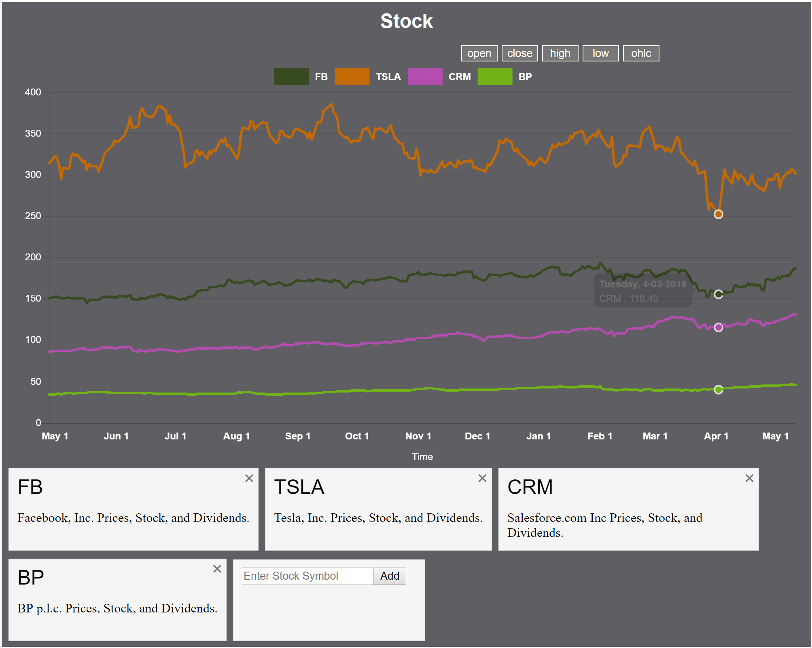

### README

#Stock Market Visualization App

##
Created using React-Redux

1. Chart will fetch new stock data after add to list from a 3rd party API
2. Open, high, low, close, or OHLC (average of open, high, low, close)
3. Future consideration is be able switch between different time frames. (under development)

[Demo Link](https://market-watch-react-redux.herokuapp.com/)